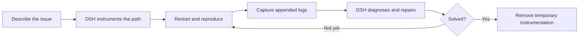

<p align="center">
  
</p>

<p align="center">
  <a href="https://github.com/bosszhangzxx-ops/dsh-bug-killer/actions/workflows/ci.yml"></a>
  
  
  
  <a href="LICENSE"></a>
</p>

<p align="center">
  <strong>Bugs lie. Logs don't.</strong><br />
  A guided, evidence-driven debugging loop for the <a href="https://github.com/deepseek-ai/deepseek-harness">DeepSeek Harness</a> Web UI.
</p>

<p align="center">English · <a href="README.zh.md">简体中文</a></p>

## What is Bug Killer?

`dsh-bug-killer` turns a repetitive debugging routine into one guided flow beside the DSH composer:

> ask the agent to add logs → restart the app → reproduce the issue → copy the new logs → explain everything again → ask for a fix

The plugin asks DSH to instrument the relevant business path, records the log-file offset before reproduction, captures only the bytes appended while the bug is reproduced, and sends that bounded evidence back for diagnosis. After the repair, the user decides whether to continue tracing or remove the temporary instrumentation.

It is designed for the awkward bugs that often throw no exception: the API returns success, but a status stays stale; the wrong branch runs; a write reports success but the business state is still wrong.

## Quick start

```bash
dsh plugin --profile web add github:bosszhangzxx-ops/dsh-bug-killer#main
dsh web
```

The repository ships prebuilt `lib/` artifacts. Users do not need to clone the source or build the plugin themselves. If DSH Web is already running, restart it after installation.

## The debugging loop



1. Open **Bug Killer**, describe the issue, and confirm the project folder.
2. DSH inspects the project type and logging setup, then adds trace-tagged logs only along the relevant method chain.
3. Restart the application. Bug Killer waits for the log file to settle and records its byte offset.
4. Reproduce the issue. The plugin reads only the new log range and redacts common secrets.
5. DSH receives the issue plus guarded log evidence, diagnoses the cause, changes the code, and runs checks.
6. Bug Killer enters a yellow **Pending confirmation** state. Choose **Not solved** to repeat the evidence loop, or **Solved, and remove instrumentation logs** to clean up the trace.

Bug Killer orchestrates the workflow; DSH performs and reports the application-code changes.

## Why it stands out

| Native workflow | Precise evidence | Local safety boundary |
| --- | --- | --- |
| Lives next to the DSH composer and tracks task completion | Captures from a byte offset instead of copying the entire log | Canonical-path checks keep project and log access inside the active workspace |
| Handles restart, reproduction, repair confirmation, and cleanup as explicit states | Detects truncation or rotation and preserves useful head/tail evidence under a size limit | Redacts common credentials and frames every log line as untrusted data |
| Supports child-project selection for multi-project workspaces | Polls before and after reproduction so buffered writes are less likely to race capture | Browser-to-host RPC is loopback-only; the plugin adds no separate telemetry or upload endpoint |

## Engineering design

The project deliberately separates browser interaction from filesystem authority:

| Layer | Responsibility |
| --- | --- |
| `src/client/` | DSH Web button, dialog state machine, project picker, and guided user actions |
| `src/index.ts` | Loopback RPC registration and validated host endpoints |
| `src/project-directory.ts` | Workspace-bounded project selection with canonical-path containment |
| `src/log-capture.ts` | Discovery, offset capture, rotation recovery, and bounded reads |
| `src/security.ts` | Input validation, path safety, control-character filtering, and secret redaction |
| `src/prompts.ts` | Technology-neutral instrumentation, diagnosis, and cleanup contracts for DSH |

### Evidence, not log dumping

- Records the current file size before reproduction and reads from that offset afterward.
- Detects a replaced, truncated, or rotated file using device, inode, birth time, and size.
- Keeps the beginning and end when the appended range exceeds the configured budget.
- Leaves an empty capture active so the user can reproduce again instead of losing the trace.
- Polls for file stability before capture starts and before the evidence is finalized.

### Safety by design

- Resolves workspace, project, and log paths through `realpath`.
- Rejects `..` traversal, symbolic-link escapes, non-regular files, and paths outside the workspace.
- Redacts common authorization headers, cookies, passwords, API keys, and tokens.
- Escapes captured text and wraps it in an explicit untrusted-evidence boundary.
- Keeps temporary instrumentation until the user confirms the repair.
- Removes only statements carrying the current Bug Killer trace ID.

> [!IMPORTANT]
> Capture and path access happen locally inside the selected workspace. After reproduction, the selected evidence is intentionally inserted into a DSH prompt and processed by the model provider configured in DSH. Bug Killer is not an offline log analyzer.

See the full [security model](SECURITY.md).

## Requirements and limitations

- Node.js `22.19+` or `24+`.
- DeepSeek Harness `0.1.0-rc.7` or a compatible release.
- A local application that can write a regular `.log` file inside the selected project folder.

Bug Killer reads files, not IntelliJ IDEA or terminal console buffers. If an application logs only to the console, the instrumentation task asks DSH to add a minimal local-only file logger. It does not attach to production hosts, Docker, Kubernetes, or remote logging platforms.

<details>
<summary>Spring Boot local logging example</summary>

```yaml
logging:
  file:
    name: logs/application.log
```

Keep this configuration in a local development profile.
</details>

## Installation options

Install the latest `main` branch:

```bash
dsh plugin --profile web add github:bosszhangzxx-ops/dsh-bug-killer#main
```

Pin a release or commit for reproducible installs:

```bash
dsh plugin --profile web add github:bosszhangzxx-ops/dsh-bug-killer#<tag-or-commit>
```

Restart `dsh web` after installing or updating the plugin.

## Configuration

| Field | Default | Purpose |
| --- | ---: | --- |
| `maxCaptureBytes` | `1048576` | Maximum appended log bytes retained per capture; allowed range is 64 KiB–10 MiB |
| `maxDiscoveryDepth` | `4` | Maximum directory depth for automatic `.log` discovery; allowed range is 1–8 |
| `redactSecrets` | `true` | Redact common secret formats before evidence reaches the browser |

## Development and verification

```bash
pnpm install
pnpm check
pnpm exec dsh plugin --profile web add .
pnpm exec dsh --profile web --dump-config
```

`pnpm check` runs strict type checking, the Vitest suite, the production build, and a package smoke test. The suite exercises the browser flow, real-file incremental capture, empty retries, truncation and replacement, bounded reads, project containment, RPC validation, secret redaction, and prompt framing. GitHub Actions runs the same gate on pushes and pull requests.

## Contributing

Issues and focused pull requests are welcome. Never attach real credentials, private application logs, or proprietary source code to a public issue. Security-sensitive reports should follow [SECURITY.md](SECURITY.md).

## License

[MIT](LICENSE)
