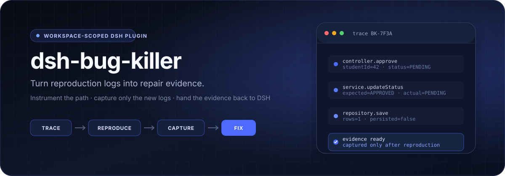
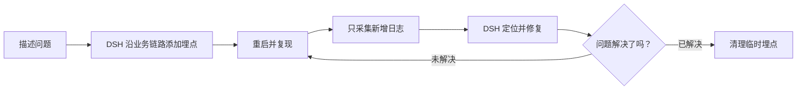

<p align="center">
  
</p>

<p align="center">
  <a href="https://github.com/bosszhangzxx-ops/dsh-bug-killer/actions/workflows/ci.yml"></a>
  
  
  
  <a href="LICENSE"></a>
</p>

<p align="center">
  <strong>Bug 会撒谎，日志不会。</strong><br />
  为 <a href="https://github.com/deepseek-ai/deepseek-harness">DeepSeek Harness</a> Web UI 打造的证据驱动调试闭环。
</p>

<p align="center"><a href="README.md">English</a> · 简体中文</p>

## Bug Killer 是什么？

`dsh-bug-killer` 把开发中反复出现的一套人工操作，收进 DSH 输入框旁边的一个按钮里：

> 让 Agent 加日志 → 重启项目 → 手动复现 → 复制新增日志 → 重新解释上下文 → 再让 Agent 修复

插件会让 DSH 沿着问题相关的业务链路添加临时埋点，在复现前记录日志文件的字节起点，只采集复现期间新增的日志，再把经过限制和安全处理的证据交回 DSH。修复结束后，由用户决定继续追踪，还是清理本次临时埋点。

它主要解决那些“不报错但结果不对”的业务 Bug：接口返回成功，状态却没有更新；程序走了错误分支；数据库操作看似成功，最终业务状态仍然异常。

## 快速开始

```bash
dsh plugin --profile web add github:bosszhangzxx-ops/dsh-bug-killer#main
dsh web
```

仓库已经包含构建好的 `lib/` 文件。普通用户无需克隆源码，也无需手动构建插件。如果 DSH Web 已经在运行，安装后需要重启。

## 调试闭环



1. 打开 **Bug Killer**，填写问题描述并确认项目目录。
2. DSH 识别项目类型和日志方式，只在相关方法链上添加带追踪标识的临时日志。
3. 重启项目。Bug Killer 等待日志稳定，并记录当前字节起点。
4. 在业务页面复现问题。插件只读取起点之后的新日志，并遮盖常见敏感信息。
5. DSH 收到问题描述和受保护的日志证据，定位根因、修改代码并执行检查。
6. Bug Killer 进入黄色“待确认”状态。选择“未解决”可继续复现；选择“已解决，并删除埋点日志”会清理本次临时埋点。

Bug Killer 负责组织调试流程；真正的业务代码修改和检查由 DSH 执行并汇报。

## 为什么它值得关注？

| 原生工作流 | 精确采集证据 | 本地安全边界 |
| --- | --- | --- |
| 按钮直接位于 DSH 输入框旁，并跟踪任务是否结束 | 从复现前的字节偏移开始读取，不复制整份历史日志 | 使用规范路径校验，把项目和日志访问限制在当前工作区内 |
| 将重启、复现、修复确认和清理拆成明确状态 | 识别日志截断或轮转，超限时保留有价值的首尾证据 | 自动遮盖常见凭证，并把每一行日志标记为不可信数据 |
| 支持多项目工作目录下的子项目选择 | 复现前后轮询日志状态，降低缓冲写入造成的采集竞争 | 浏览器与宿主只通过本机 RPC 通信，插件不增加独立遥测或额外上传接口 |

## 工程设计

项目刻意把浏览器交互与文件系统权限分开：

| 模块 | 职责 |
| --- | --- |
| `src/client/` | DSH Web 按钮、弹窗状态机、项目选择器和分步交互 |
| `src/index.ts` | 注册仅限本机的 RPC，并校验宿主端请求 |
| `src/project-directory.ts` | 在工作区安全边界内选择项目目录 |
| `src/log-capture.ts` | 日志发现、偏移采集、轮转恢复和限额读取 |
| `src/security.ts` | 输入校验、路径安全、控制字符过滤和敏感信息脱敏 |
| `src/prompts.ts` | 提供与技术栈无关的埋点、诊断和清理任务约束 |

### 采集证据，不是倾倒日志

- 复现前记录文件大小，复现后只读取该偏移之后的内容。
- 结合设备号、inode、创建时间和文件大小识别替换、截断与轮转。
- 新增日志超过上限时保留开头和结尾，并标明省略字节数。
- 没有采集到新增日志时保留当前追踪，让用户可以再次复现。
- 开始采集和完成复现时轮询文件状态，等待缓冲日志写入稳定。

### 安全不是事后补丁

- 工作区、项目和日志路径全部经过 `realpath` 规范化。
- 拒绝 `..` 路径穿越、符号链接逃逸、非普通文件和工作区外路径。
- 遮盖常见 Authorization、Cookie、密码、API Key 和 Token。
- 对日志内容进行转义，并放入明确的“不可信证据”边界。
- 用户确认修复前一直保留临时埋点，避免修复尚未验证就丢失证据。
- 清理时只删除带有本次 Bug Killer 追踪标识的日志语句。

> [!IMPORTANT]
> 日志采集和路径访问发生在本机所选工作区内；完成复现后，选中的日志证据会被放入 DSH 提示词，并由 DSH 中配置的模型提供方处理。Bug Killer 不是完全离线的日志分析器。

完整边界参见 [安全模型](SECURITY.md)。

## 使用条件与限制

- Node.js `22.19+` 或 `24+`。
- DeepSeek Harness `0.1.0-rc.7` 或兼容版本。
- 本地项目能够将日志写入所选项目目录内的普通 `.log` 文件。

Bug Killer 读取日志文件，不能直接读取 IntelliJ IDEA 或终端的控制台缓冲区。若项目只有控制台输出，埋点任务会要求 DSH 添加最小化、仅本地启用的文件日志配置。它不会连接生产服务器、Docker、Kubernetes 或远程日志平台。

<details>
<summary>Spring Boot 本地日志示例</summary>

```yaml
logging:
  file:
    name: logs/application.log
```

建议只在本地开发环境配置中启用。
</details>

## 安装方式

安装最新的 `main` 分支：

```bash
dsh plugin --profile web add github:bosszhangzxx-ops/dsh-bug-killer#main
```

需要稳定复现安装结果时，可以固定 Release 或提交：

```bash
dsh plugin --profile web add github:bosszhangzxx-ops/dsh-bug-killer#<tag-or-commit>
```

安装或更新插件后，请重启 `dsh web`。

## 配置

| 字段 | 默认值 | 说明 |
| --- | ---: | --- |
| `maxCaptureBytes` | `1048576` | 单次最多保留的新增日志字节数，允许范围为 64 KiB–10 MiB |
| `maxDiscoveryDepth` | `4` | 自动发现 `.log` 文件的最大目录深度，允许范围为 1–8 |
| `redactSecrets` | `true` | 日志证据进入浏览器前遮盖常见敏感信息 |

## 开发与验证

```bash
pnpm install
pnpm check
pnpm exec dsh plugin --profile web add .
pnpm exec dsh --profile web --dump-config
```

`pnpm check` 会依次执行 TypeScript 严格类型检查、Vitest 测试、生产构建和包冒烟检查。测试覆盖浏览器完整流程、真实文件增量读取、空日志重试、日志截断和替换、限额读取、项目路径隔离、RPC 校验、敏感信息脱敏和提示词边界。GitHub Actions 会在推送和 Pull Request 时执行同一套质量门禁。

## 参与贡献

欢迎提交问题和范围明确的 Pull Request。请勿在公开 Issue 中附带真实凭证、私有业务日志或公司源代码；安全敏感问题请按照 [SECURITY.md](SECURITY.md) 说明处理。

## License

[MIT](LICENSE)
